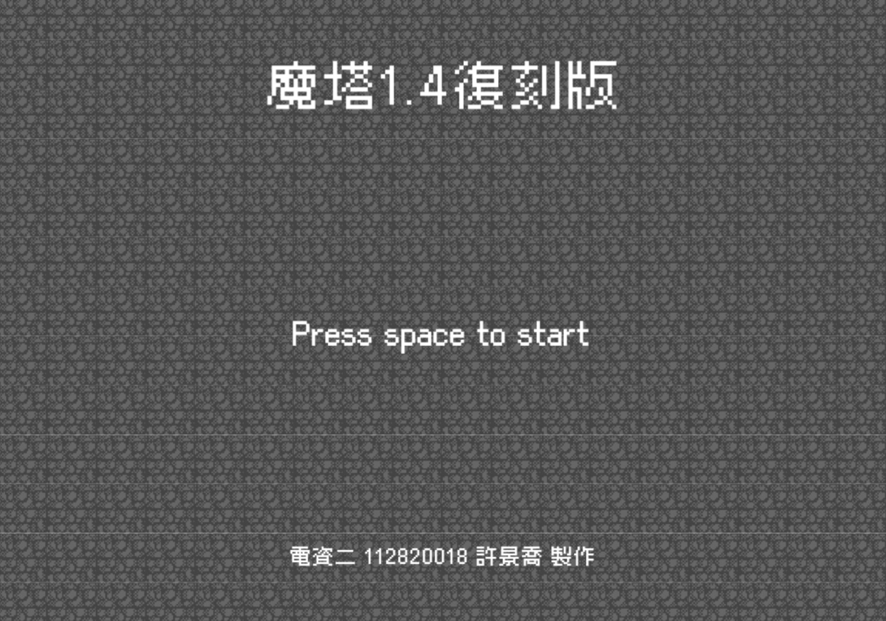
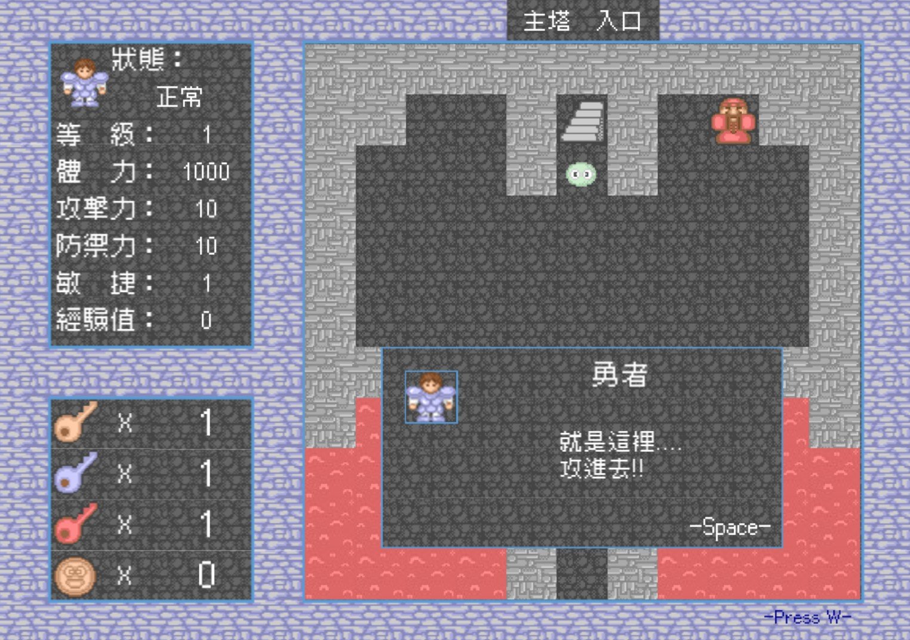

# 2025 OOPL Final Report

## 組別資訊
- 組別：24
- 組員：112820018 許景喬
- 復刻遊戲：魔塔

## 專案簡介
### 遊戲簡介
- 因為我開學時還不知道要做什麼遊戲，所以我就去詢問漢軒助教，他推薦我製作他上次修OOPL製作的魔塔，我看到魔塔覺得很有趣，所以就決定要做魔塔。
- 這次製作的魔塔原版是地上 20 層魔塔與地下 25 層魔塔，以及 10 關隱藏關卡的遊戲，但我只有製作地上 20 層魔塔以及 5 關隱藏關卡，並且做了一些劇情上的更動。

### 組別分工
- 因為我是一個人一組，所以遊戲是由我一個人完成。

## 遊戲介紹
### 遊戲規則
- **攻略魔塔** - 按鍵
  - Space - 確認
  - 上下左右 - 操縱勇者移動
  - R - 重新開始
  - Q - 撤退（攻擊中使用）
  - S - 加速攻擊過程（攻擊中使用）
  - A - 讓勇者的攻擊力變為3571（再按一次回復原本的攻擊力）
    - 切換成Debug模式中所讓攻擊力上升，也會加在原本的攻擊力上，不會加在3571上
  - W - 查看功能列表（再按一次關閉功能列表）
- **攻擊規則**
  - 勇者攻擊1次，敵人攻擊1~3次（根據攻擊次數來定）
  - 勇者攻擊敵人
    - 傷害 = 勇者攻擊力 - 敵人防禦力
    - 特殊條件
      - 如果傷害 == 0 - 傷害 = 1
      - 會有（敵人敏捷）%的機會被敵人迴避攻擊
  - 敵人攻擊勇者
    - 傷害 = 敵人攻擊力 - 勇者防禦力
      - 如果敵人有無視防禦力的特殊能力，就不須扣掉勇者防禦力
    - 特殊條件
      - 如果傷害 <= 0 -> 傷害 = 1
      - 會有（勇者敏捷）%的機會被勇者迴避攻擊
      - 如果敵人有必殺攻擊的特殊能力，就有10%的機會直接被擊殺
      - 如果敵人有衰弱的特殊能力，就有1%的機會受到衰弱攻擊
      - 如果敵人有中毒的特殊能力，就有1%的機會受到中毒攻擊
        - 但我們做的遊戲關卡內沒有中毒攻擊的敵人
- **道具獎勵**
  - 上下左右 - 觸碰道具，獲得道具
- **NPC對話**
  - 上下左右 - 觸碰NPC，和NPC對話
- **開啟門**
  - 上下左右 - 觸碰門，判斷使否有對應鑰匙，打開門
- **樓層上下**
  - 上下左右 - 從其他走道踩上樓梯，觸發上樓梯機制
- **商店購物**
  - 上下左右 - 觸碰商店(如果是三個連著的大商店，需觸碰中間的商店)，開啟商店選擇介面

### 遊戲畫面
|   階段   |                        遊戲畫面                        |
|:------:|:--------------------------------------------------:|
|  開始畫面  |    |
|  故事畫面  |    |
|  攻略魔塔  |    |
| NPC對話  |   |
|  敵人打架  |    |
|  打贏獎勵  |    |
|  領取道具  |    |
|  商店採買  |    |
| 查看敵人資料 |  |
|  樓層飛行  |    |
|  按鍵說明  |    |
|  巨大怪物  |    |
|  假公主   |     |
|  真公主   |     |
| 失敗結束畫面 |  |
| 勝利結束畫面 |  |

## 程式設計
### 程式架構

- `Util::GameObject` - PTSD中的遊戲物件
  - `AnimationObject` - 動畫呈現的遊戲物件
    - `Thing` - 基礎地圖物件
      - `Road` - 地圖上的路跟牆
      - `Enemy` - 地圖上的敵人
        - `BigEnemy` - 地圖上的巨大敵人
        - `FakePrincess` - 地圖上的假公主
      - `Item` - 地圖上的道具
      - `NPC` - 地圖上的NPC
      - `Door` - 地圖上的門
      - `Stair` - 地圖上的樓梯和特殊樓梯
      - `Shop` - 地圖上的商店
  - `ImageObject` - 圖片呈現的遊戲物件
  - `TextObject` - 文字呈現的遊戲物件
  - `BackgroundImage` - 背景圖片 - 內涵切換背景的函式
- `Dialog` - 基礎對話框物件
  - `ItemDialog` - 獲得道具的對話框（可能會被NPC觸發）
  - `NPCDialog` - 跟NPC對話的對話框
  - `ShopDialog` - 商店購物的對話框
- `EnemyDataManager` - 查看敵人資料的介面
  1. 使用`EnemyData`複製一頁三個敵人資訊
- `Fighting` - 戰鬥介面
- `Fly` - 飛行介面
- `SceneManager` - 場景控制
- `MapManager` - 地圖控制、勇者觸碰其他物體
- `App` - 主遊戲架構

### 程式技術
- **控制狀態**
  - 使用enum控制當前畫面與`FakePrincess`的狀態
    - 例如：開始畫面、故事畫面、攻略魔塔、結束畫面
- **分類不同物件**
  - 地圖物件：
    - 一開始分析這個遊戲的時候發現地圖上的物件（除了勇者）大致分成7（路牆、敵人、道具、NPC、門、樓梯、商店），因此我設立了父物件`Thing`，讓地圖上的其他子物件都可以繼承父物件。將他們編號好讓地圖可以只用數字表示且分類每種不同的物件。
  - 對話框：
    - 我一開始發現獲得道具跟NPC對話還有商店採買東西的介面都有一個可變動的文字對話框，我就創建了`Dialog`的父物件讓`ItemDialog`, `NPCDialog`, `ShopDialog`繼承。
- **NPC對話特殊事件**
  - 一些`NPC`互動是一些買賣，因此我把它當作是`Shop`，進行`Shop`被觸發做的事情。
  - 一些`NPC`不只是有對話，還有多次來回對話、獲得獎勵和對話完消失之類的情況，因此我在`NPC`對話的腳本中加入了一些特出規則。
    - 例如：用csv儲存，第一格為判斷格（類似opcode），可以寫上`對話角色的名稱`, `0`, `item`, `hide`, `win`，分別代表新的一個對話格、延續上個對話格的下一行話、對話結束獲得物品、對話結束消失在地圖上、對話結束勝利（只有真公主會用到）。
- **檔案讀取**
  - 我建立了`Read.hpp`來包裝檔案讀取的function。
    - 例如：`split_csv`和`open_csv`是讀取csv並將他們切割開來、`open_txt`是讀取txt的資料。
- **可加快攻擊的迭代速度**
  - 原本的魔塔沒辦法加快攻擊的速度，只能等他們慢慢打，但我在試玩的時候覺得慢慢打太慢了，所以我新增了按鍵可以加快雙方攻擊的速度，上破關時間可以快一點。
- **死靈系列敵人**
  - 死靈系列敵人死後會在同地點重生一隻比較弱的角色，因此我就在`Enemy`中新增一個`Next_Enemy`敵人死後可以直接變成下一個敵人，這樣就不需要新增一個新的敵人。

## 結語
### 問題與解決方法
- 亂數產生器感覺並不亂數
  - 因為我產生亂數種子應該放在程式執行的一開始，而不是要用到亂數當下的函式
- 假公主的繼承問題
  - 我在設計假公主的時候，發現假公主會先需要跟他對話，對話完勇者的後路會被封住，才會變成觸發打架功能，因此我原本的設計是讓`FakePrincess`同時繼承`Enemy`和`NPC`，但發現這樣會造成菱形繼承的問題，因為`Enemy`和`NPC`都繼承了`Thing`，因此經過助教的建議後我改讓`FakePrincess`只繼承`Enemy`，但在內部會有一個`NPC`的物件再讓`FakePrincess`自己控制是要觸發`Enemy`的`Touch`或是`NPC`的`Touch`。

### 自評
| 項次 | 項目                      | 完成 |
|:--:|-------------------------|:--:|
| 1  | 完成專案權限改為 public         | V  |
| 2  | 具有 debug mode 的功能       | V  |
| 3  | 解決專案上所有 Memory Leak 的問題 | V  |
| 4  | 報告中沒有任何錯字，以及沒有任何一項遺漏    | V  |
| 5  | 報告至少保持基本的美感，人類可讀        | V  |

### 心得
- **112820018 許景喬**
  - 在這次「魔塔」的遊戲製作中，我發現了許多一般玩遊戲或寫程式不會發現的細節，也了解了如何使用C++撰寫遊戲（雖然框架式助教開發的）做遊戲的過程中我感覺非常開心，並且有成就感，可以把遊戲畫面變出來真的很有趣。我非常感謝提供我遊戲主題的黃漢軒助教，要是沒有他我可能連遊戲都不知道要做哪個。

### 貢獻比例
|      組員       | 貢獻度  |
|:-------------:|:----:|
| 112820018 許景喬 | 100% |
