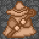
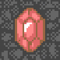
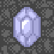
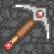

# 筆記整理

## 史萊母系：
### 最初級的怪物，除了白銀黃金史萊母要特殊戰鬥外，其他都滿好解決
|    怪物     |                            照片                             | 體力  | 攻擊  |  防禦  | 敏捷 | 經驗值 | 金幣 |         備註         |
|:---------:|:---------------------------------------------------------:|:---:|:---:|:----:|:--:|:---:|:--:|:------------------:|
|   綠色史萊母   |    | 40  | 18  |  1   | 0  |  1  | 1  | 用神劍之證可把大部分怪物變綠色史萊母 |
|   紅色史萊母   |        | 50  | 20  |  4   | 0  |  1  | 2  |                    |
|   黑色史萊母   |        | 80  | 37  |  9   | 0  |  1  | 5  |                    |
|   史萊母王    |      | 172 | 130 |  60  | 2  |  2  | 19 |                    |
| ~~白銀史萊母~~ |  | 10  | ??? | 8000 | 9  |  0  | 0  |   特殊戰鬥 失敗一次血-250   |
| ~~黃金史萊母~~ |      | 20  | ??? | 9999 | 30 |  0  | 0  |   特殊戰鬥 失敗一次血-400   |

## 蝙蝠系：
### 能力不會算很高，但是會多段攻擊，要注意能力值差是否會帶來重大損傷
|   怪物    |                           照片                            |  體力  | 攻擊  | 防禦  | 敏捷 | 經驗值 | 金幣  |    備註     |
|:-------:|:-------------------------------------------------------:|:----:|:---:|:---:|:--:|:---:|:---:|:---------:|
|   蝙蝠    |                  |  55  | 32  |  2  | 4  |  1  |  3  |           |
|   大蝙蝠   |          |  65  | 55  | 12  | 4  |  1  |  6  |   二段攻擊    |
|   紅蝙蝠   |          | 210  | 185 | 70  | 4  |  3  | 24  |   三段攻擊    |
| ~~毒蝙蝠~~ |  | 1091 | 971 | 950 | 5  | 16  | 150 | 二段攻擊+中毒攻擊 |

## 魔法師系：
### 攻擊無視其防禦，要加攻擊盡快打倒
|    怪物     |                                照片                                 |  體力  | 攻擊  | 防禦  | 敏捷 | 經驗值 | 金幣  |       備註       |
|:---------:|:-----------------------------------------------------------------:|:----:|:---:|:---:|:--:|:---:|:---:|:--------------:|
|    魔法師    |                  |  65  | 10  |  5  | 0  |  1  |  4  |     無視防禦攻擊     |
|   中級魔法師   |                  | 190  | 20  | 20  | 0  |  1  |  8  |     無視防禦攻擊     |
|   上級魔法師   |                  | 290  | 40  | 90  | 0  |  3  | 27  |     無視防禦攻擊     |
|   魔法師首領   |  | 330  | 70  | 150 | 5  |  5  | 43  |     無視防禦攻擊     |
|   魔法師元帥   |  | 380  | 90  | 280 | 5  |  6  | 59  |     無視防禦攻擊     |
|    大法師    |              | 450  | 100 | 302 | 1  |  8  | 77  |     無視防禦攻擊     |
| ~~紅衣大法師~~ |              | 875  | 120 | 513 | 1  | 11  | 101 |     無視防禦攻擊     |
| ~~暗黑魔法師~~ |        | 1650 | 220 | 920 | 6  | 51  | 500 | 無視防禦攻擊 在魔塔10出現 |

## 骷髏系：
### 防禦力差但攻擊力高，最好能力調到頂多只被打一下
|    怪物     |                          照片                           |  體力  |  攻擊  | 防禦  | 敏捷 | 經驗值 | 金幣  |  備註  |
|:---------:|:-----------------------------------------------------:|:----:|:----:|:---:|:--:|:---:|:---:|:----:|
|    骷髏     |  |  95  | 70   |  0  | 3  |  1  |  5  |      |
|    骷髏兵    |  | 190  | 100  |  5  | 3  |  2  | 13  |      |
|   中級骷髏兵   |  | 290  | 170  | 23  | 3  |  3  | 21  |      |
| ~~高級骷髏兵~~ |  | 1020 | 1342 | 600 | 3  | 15  | 145 | 衰弱攻擊 |

## 喪屍系：
### 能力頗高，初期先別與其起衝突，等自身能力值較高時再對付
|    怪物    |                             照片                              |  體力   |  攻擊   |  防禦  | 敏捷 | 經驗值 | 金幣  |  備註  |
|:--------:|:-----------------------------------------------------------:|:-----:|:-----:|:----:|:--:|:---:|:---:|:----:|
|    喪屍    |                |  190  |  90   |  33  | 2  |  2  | 15  |      |
| ~~喪屍士兵~~ |  |  511  |  353  | 230  | 1  |  6  | 50  |      |
| ~~毒喪屍~~  |  | 1310  | 1083  | 951  | 2  | 16  | 152 | 中毒攻擊 |

## 守衛系：
### 防禦力高，最好打自身防禦調到與對方攻擊力差不多
|    怪物    |                             照片                              |  體力  | 攻擊  | 防禦  | 敏捷 | 經驗值 | 金幣  | 備註 |
|:--------:|:-----------------------------------------------------------:|:----:|:---:|:---:|:--:|:---:|:---:|:--:|
|   初級守衛   |  |  85  | 40  | 55  | 3  |  1  |  6  |    |
|   中級守衛   |  | 775  | 220 | 310 | 3  |  7  | 63  |    |
| ~~高級守衛~~ |  | 1150 | 651 | 860 | 4  | 12  | 110 |    |

## 史萊姆人系：
### 迴避高，除了要多召喚謝先生以外，防禦業要盡量衝高以達最小損失
|   怪物    |                           照片                            | 體力  | 攻擊  | 防禦  | 敏捷 | 經驗值 | 金幣  |  備註 |
|:-------:|:-------------------------------------------------------:|:---:|:---:|:---:|:--:|:---:|:---:|:---:|
|  史萊姆人   |      | 90  | 79  | 24  | 30 |  2  | 10  | 高迴避 |
| ~~水銀人~~ |  | 810 | 802 | 753 | 50 | 15  | 140 | 高迴避 |

## 石怪系：
### 防禦高血少，但鐵怪一定得被迫打五十下
|   怪物   |                               照片                                | 體力 | 攻擊  | 防禦  | 敏捷 | 經驗值 | 金幣  | 備註 |
|:------:|:---------------------------------------------------------------:|:--:|:---:|:---:|:--:|:---:|:---:|:--:|
|   石怪   |  | 30 | 45  | 70  | 0  |  1  |  7  |    |
| ~~鐵怪~~ |  | 50 | 600 | 990 | 0  | 14  | 132 |    |

## 靈骷髏系：
### 靈骷髏兵和靈武士被擊殺後會再生，但能力必低於自生能力，可以賺錢及exp
|   怪物    |                                    照片                                     |  體力  |  攻擊  |  防禦  | 敏捷 | 經驗值 | 金幣  |     備註     |
|:-------:|:-------------------------------------------------------------------------:|:----:|:----:|:----:|:--:|:---:|:---:|:----------:|
|   靈骷髏   |                | 295  | 404  | 282  | 3  |  8  | 70  |            |
|  靈骷髏兵   |  | 800  | 602  | 560  | 4  |  4  | 30  | 被擊殺後再生靈骷髏  |
| ~~靈武士~~ |                                                                           | 1060 | 1118 | 1030 | 5  | 11  | 100 | 被擊殺後再生靈骷髏兵 |

## 騎士系：
### 命中要害機率高達30%，要多召喚謝先生
|    怪物    |                             照片                              | 體力  | 攻擊  | 防禦  | 敏捷 | 經驗值 | 金幣 |  備註  |
|:--------:|:-----------------------------------------------------------:|:---:|:---:|:---:|:--:|:---:|:--:|:----:|
|    騎士    |                | 130 | 115 | 43  | 4  |  2  | 17 | 必殺攻擊 |
| ~~鐵騎士~~  |  | 420 | 388 | 258 | 4  |  6  | 54 | 必殺攻擊 |
| ~~近衛騎士~~ |  | 992 | 753 | 677 | 4  | 13  | 24 | 必殺攻擊 |

## 雙手劍士系：
### 能力高且會多段攻擊，盡量把防禦衝高再對付求最小損失
|   怪物   |                           照片                            |  體力  | 攻擊  | 防禦  | 敏捷 | 經驗值 | 金幣  |  備註  |
|:------:|:-------------------------------------------------------:|:----:|:---:|:---:|:--:|:---:|:---:|:----:|
|  雙手劍兵  |      | 280  | 210 | 110 | 4  |  4  | 34  | 二段攻擊 |
| ~~劍王~~ |  | 1065 | 894 | 770 | 6  | 15  | 145 | 四段攻擊 |

## 魔王系：
### 能力很高，要提升自己的能力再對付
|   怪物    | 照片 |  體力  |  攻擊  | 防禦  | 敏捷 | 經驗值 | 金幣  |         備註          |
|:-------:|:--:|:----:|:----:|:---:|:--:|:---:|:---:|:-------------------:|
| ~~魔王~~  |    | 635  | 600  | 500 | 6  |  9  | 88  |                     |
| ~~大魔王~~ |    | 1000 | 1200 | 980 | 7  | 41  | 400 | 衰弱攻擊 出現在B24通往B25樓梯口 |

## 巨大系：
### 能力強，通常都是守護重要的道具
|   怪物   |                                照片                                 |  體力  |  攻擊  | 防禦  | 敏捷 | 經驗值 | 金幣  |          備註          |
|:------:|:-----------------------------------------------------------------:|:----:|:----:|:---:|:--:|:---:|:---:|:--------------------:|
|  巨大章魚  |              | 700  | 295  | 120 | 5  | 18  | 170 | 衰弱攻擊 出現在15層守護通往魔塔的路口 |
| ~~巨龍~~ |                | 1390 | 891  | 668 | 5  | 41  | 400 |     出現在B10守護神劍之症     |
| ~~毒龍~~ |  | 2350 | 1400 | 930 | 7  | 61  | 600 |    中毒攻擊 出現在魔塔9守護劍    |

## 假怪物：
|   怪物    |                        照片                         |  體力  | 攻擊  | 防禦  | 敏捷 | 經驗值 | 金幣  |     備註     |
|:-------:|:-------------------------------------------------:|:----:|:---:|:---:|:--:|:---:|:---:|:----------:|
|   假公主   |  | 600  | 270 | 160 | 5  | 13  | 120 |   出現在20層   |
| ~~假自己~~ |      | 1000 | 325 | 160 | 5  | 31  | 300 | 魔塔5層拿完章後出現 |

## Boss：
|    怪物     | 照片 |  體力  |  攻擊  |  防禦  | 敏捷 | 經驗值 | 金幣 |      備註      |
|:---------:|:--:|:----:|:----:|:----:|:--:|:---:|:--:|:------------:|
| ~~魔王格勒地~~ |    | 5000 | 1500 | 1200 | 20 |  0  | 0  | 二段攻擊 最終頭目大魔王 |

## 還沒歸類的
- ### dark_knight
- ### magic_sergeant_ab
- ### monster
- ### vampire

## 對白
|  樓層  | 人物 | 對話                                                                                                                                                                                                                   |
|:----:|:--:|:---------------------------------------------------------------------------------------------------------------------------------------------------------------------------------------------------------------------|
|  入口  | 勇者 | 就是這裡.... 攻進去!!                                                                                                                                                                                                   |
|  入口  | 商人 | 又是挑戰者嗎? 希望你能夠活著回去, 嘻嘻嘻嘻...                                                                                                                                                                                   |
|  1F  | 老人 | 聽說這座塔不只20層... 但是最高只能去到第20層.. 真叫人頭痛...                                                                                                                                                                        |
|  1F  | 商人 | 你知道甚麼是章嗎? 在這裡有數個不同的章,只要 拿到就可以得到一些有利戰鬥 的能力,  但是章要被鑑定後才可以使用 你必須找到一個懂鑑定的人!                                                                                                                      |
|  2F  | 商人 | 你認識那個被抓住的盜賊嗎? 聽說他來這裡是為了找一個 鋤頭,不知他要來幹甚麼呢...                                                                                                                                                                   |
|  2F  | 盜賊 | 來!手上缺少哪一種 鑰匙?我有大量的! A:黃鑰匙(\$20) B:藍鑰匙(\$80) C:離開  (拿到鋤頭後) 咦!這不就是我的鋤頭嗎! 謝謝你替我找回來! 讓我替你打開 通往地下的通道吧!                                                                            |
|  4F  | 商人 | $15就可以回復200體力 需要嗎? A:要! B:離開  取得 兩顆紅寶石,攻擊力+4 之後消失                                                                                                                                            |
|  5F  | 老人 | 這個給你... 有了這個, 就可看清楚怪物的能力...  取得 心鏡,按D鍵可知道怪物的能力 之後消失                                                                                                                                              |
|  5F  | 商人 | 我這裡有兩個紅寶石. 你想要嗎? $40賣給你吧! A:要! B:離開                                                                                                                                                                  |
|  8F  | 老人 | 你真了不起 竟然能來到這層! 這個給你吧!  取得 黃金色羽根,按F鍵可啟動飛行功能 之後消失                                                                                                                                                  |
| 13F  | 商人 | 那些騎士的必殺率高達30%, 請小心...                                                                                                                                                                                            |
| 14F  | 老人 | **老人:** 啊!!!!!!! 你的劍!!你的盾!!!! 全都是古董呢!!!!! **勇者:** ? 你懂鑑定嗎? **老人:** 這簡單的東西怎麼會難倒我! **勇者:** 啊! 我有東西給你鑑定 你等我一下! **老人:** 隨時歡迎 (沒拿到東西來) 怎樣? 不是有東西要判定嗎? |
| 15F  | 商人 | 你有鑰匙嗎? 我願意大量收購 A:黃鑰匙(\$10) B:藍鑰匙(\$40) C:紅鑰匙($250) D:離開                                                                                                                                          |
| 19F  | 老人 | 公主就在上一層, 但聽說有惡魔守著, 如果實力不夠千萬不要上去                                                                                                                                                                              |
| 20F  | 公主 | **勇者:** 公主, 我們走吧!這裡很危險的! **公主:** ...... **勇者:** 怎麼了 **公主:** 哈哈哈哈哈哈 受死吧!!!(男聲) (退路被封起來) (打死假公主後) **公主:** 真正的公主在這座塔的最底部 有本事就來救她吧! (新增獎勵在地圖上)               |
| 魔塔5F | 老人 |

## 商店
| 樓層 |  名稱  |                        圖片                        | 對話                                                                                                          |
|:--:|:----:|:------------------------------------------------:|:------------------------------------------------------------------------------------------------------------|
| 3F | 貪婪之神 |  | 人類阿!如果你願意 給我20(每買一次往上加1)個金幣的話 我可以加強你的戰鬥力! A:增加500點體力 B:增加3點攻擊力 C:增加3點防禦力 D:離開       |
| 7F | 戰鬥之神 |  | 可憐的勇者啊! 我可以將你累積得來的 經驗化作你的力量! A:提升一個等級(Exp70) B:增加1點攻擊力(Exp20) C:增加2點防禦力(Exp20) D:離開 |

## 物品
### 取得...
|   物品    |                                 圖片                                 | 提示字          | 備註  |
|:-------:|:------------------------------------------------------------------:|:-------------|:----|
|   黃鑰匙   |            | 黃鑰匙          |     |
|   藍鑰匙   |                | 藍鑰匙          |     |
|   紅鑰匙   |                  | 紅鑰匙          |     |
|  魔法之匙   |              | 魔法之匙,所有鑰匙數+1 |     |
|   錢幣    |                            | 金幣200塊       |     |
|   紅寶石   |                        | 紅寶石,攻擊力+2    |     |
|   藍寶石   |                | 藍寶石,防禦力+2    |     |
|   綠寶石   |                  | 綠寶石,敏捷+1     |     |
|   紅傷藥   |         | 傷藥,體力+150    |     |
|   藍傷藥   |       | 高級傷藥,體力+400  |     |
|   火酒    |         | 火酒,回復衰弱狀態    |     |
|   抗毒劑   |       | 抗毒劑,回復毒狀態    |     |
|  躍進之翼   |                  | 躍進之翼,等級提升一   |     |
|  4F鐵劍   |            | 鐵劍,攻擊力+8     |     |
| 6F皮革之盾  |          | 皮革之盾,防禦力+7   |     |
|  11F鋤頭  |      |              |     |
|  12F鐵盾  |          | 鐵盾,防禦力+13    |     |
|  17F盾牌  |  |              |     |
|  18F長劍  |            | 長劍,攻擊力+16    |     |
| 19F寶石鋤頭 |            | 寶石鋤頭         |     |
|  20F鋤頭  |                    | 鋤頭           | 給盜賊 |
| 魔塔5F綠色  |                |              |     |
| 魔塔5F藍色  |                  |              |     |
| 魔塔5F紅色  |                    |              |     |